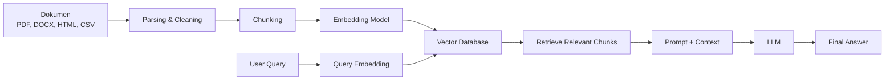

Saat membahas Artificial Intelligence, kita sering mendengar istilah **data**. Namun, tidak semua data memiliki bentuk yang rapi seperti tabel Excel atau database SQL. Sebagian besar data yang kita gunakan sehari-hari justru hadir dalam bentuk yang tidak selalu terstruktur, misalnya dokumen PDF, email, artikel, gambar, rekaman suara, video, chat, hingga postingan media sosial.

Jenis data seperti ini disebut **unstructured data**.

Unstructured data menjadi semakin penting karena banyak sistem AI modern, termasuk sistem berbasis Large Language Model atau LLM, membutuhkan informasi dari berbagai sumber yang tidak selalu tersedia dalam bentuk tabel. Di sinilah konsep seperti **Retrieval-Augmented Generation (RAG)** mulai banyak digunakan.

## Apa Itu Unstructured Data?

**Unstructured data** adalah data yang tidak memiliki format atau struktur baku. Data ini tidak langsung cocok dimasukkan ke dalam tabel dengan baris dan kolom seperti database relasional.

Contoh sederhananya:

- Artikel blog
- File PDF
- Dokumen Word
- Email
- Chat atau pesan instan
- Gambar
- Video
- Audio
- Transkrip percakapan
- Postingan media sosial
- Data sensor atau IoT

Berbeda dengan data terstruktur, unstructured data biasanya lebih bebas bentuknya. Misalnya, dua file PDF bisa sama-sama berisi informasi penting, tetapi layout, panjang teks, tabel, gambar, dan gaya penulisannya bisa sangat berbeda.

## Structured, Semi-structured, dan Unstructured Data

Agar lebih mudah dipahami, mari bedakan tiga jenis data berikut.

| Jenis Data | Ciri Utama | Contoh |
| --- | --- | --- |
| Structured data | Memiliki format tetap dan mudah dimasukkan ke tabel | Data pelanggan, transaksi, stok barang |
| Semi-structured data | Tidak sepenuhnya berbentuk tabel, tetapi masih punya pola atau metadata | JSON, XML, CSV |
| Unstructured data | Tidak memiliki format tetap dan biasanya lebih sulit diproses langsung | PDF, email, gambar, video, audio |

Structured data mudah dicari dengan query biasa, misalnya SQL. Namun, unstructured data membutuhkan proses tambahan agar bisa dipahami oleh sistem komputer atau AI.

## Kenapa Unstructured Data Penting?

Banyak informasi penting di dunia nyata tersimpan dalam bentuk unstructured data. Misalnya, perusahaan mungkin memiliki banyak dokumen kebijakan, laporan internal, kontrak, percakapan pelanggan, dan email yang berisi pengetahuan penting.

Masalahnya, data seperti ini sering kali sulit dimanfaatkan secara langsung.

Contohnya, jika sebuah perusahaan ingin membuat chatbot internal yang bisa menjawab pertanyaan karyawan berdasarkan dokumen perusahaan, maka chatbot tersebut perlu memahami isi PDF, dokumen, atau halaman knowledge base. Jika dokumen-dokumen itu tidak diproses dengan benar, AI bisa memberikan jawaban yang kurang relevan atau bahkan keliru.

Di sinilah unstructured data perlu diolah agar bisa digunakan dalam sistem AI.

## Hubungan Unstructured Data dengan RAG

**RAG** atau **Retrieval-Augmented Generation** adalah pendekatan yang memungkinkan LLM mengambil informasi dari sumber eksternal sebelum menghasilkan jawaban.

Secara sederhana:

1. User mengajukan pertanyaan.
2. Sistem mencari dokumen atau potongan informasi yang relevan.
3. Informasi tersebut diberikan sebagai konteks tambahan ke LLM.
4. LLM membuat jawaban berdasarkan pertanyaan dan konteks yang ditemukan.

Dengan RAG, model tidak hanya bergantung pada pengetahuan bawaan saat training. Sistem bisa mengambil informasi terbaru atau informasi spesifik dari dokumen internal.

Contohnya:

> User bertanya: "Apa syarat refund berdasarkan kebijakan perusahaan?"

Tanpa RAG, LLM mungkin menjawab secara umum berdasarkan pengetahuan yang sudah dimilikinya. Namun dengan RAG, sistem dapat mencari dokumen kebijakan refund perusahaan terlebih dahulu, mengambil bagian yang relevan, lalu menjadikannya konteks untuk menghasilkan jawaban yang lebih akurat.

## Gambaran Alur RAG Pipeline

Berikut gambaran sederhana alur RAG pipeline:



Pipeline ini menunjukkan bahwa dokumen tidak langsung diberikan begitu saja ke LLM. Dokumen perlu diproses terlebih dahulu agar bagian yang paling relevan bisa ditemukan dengan cepat.

## Komponen Utama dalam RAG Pipeline

### 1. Dokumen atau Data Source

Tahap pertama adalah mengumpulkan data yang ingin digunakan sebagai knowledge base. Data ini bisa berupa:

- PDF
- DOCX
- HTML
- CSV
- Markdown
- Artikel website
- Database internal
- Catatan meeting
- FAQ perusahaan

Pada tahap ini, data biasanya masih mentah dan belum siap digunakan oleh AI.

### 2. Parsing dan Cleaning

Dokumen mentah perlu dibaca dan dibersihkan. Misalnya, file PDF perlu diekstrak menjadi teks. Jika ada header, footer, nomor halaman, atau teks berulang yang tidak penting, bagian tersebut bisa dibersihkan.

Tujuan tahap ini adalah membuat isi dokumen lebih mudah diproses.

Contoh hasil cleaning:

```text
Sebelum:
Page 1 - Confidential Document
Kebijakan refund berlaku maksimal 7 hari setelah transaksi.
Company Internal Use Only

Sesudah:
Kebijakan refund berlaku maksimal 7 hari setelah transaksi.
```

### 3. Chunking

Setelah dokumen menjadi teks, teks tersebut dibagi menjadi bagian-bagian kecil yang disebut **chunk**.

Chunking penting karena LLM dan embedding model bekerja lebih efektif jika informasi dibagi dalam potongan yang lebih fokus. Jika satu dokumen terlalu panjang, sistem akan lebih sulit menemukan bagian yang benar-benar relevan.

Contoh:

```text
Dokumen panjang:
"Kebijakan refund ... Syarat pembayaran ... Ketentuan pengiriman ..."

Setelah chunking:
Chunk 1: Kebijakan refund
Chunk 2: Syarat pembayaran
Chunk 3: Ketentuan pengiriman
```

Chunk yang baik biasanya tidak terlalu pendek dan tidak terlalu panjang. Jika terlalu pendek, konteks bisa hilang. Jika terlalu panjang, pencarian bisa menjadi kurang presisi.

### 4. Embedding Model

Setelah teks dibagi menjadi chunk, setiap chunk diubah menjadi representasi angka yang disebut **embedding**.

Embedding membantu sistem memahami makna teks, bukan hanya mencocokkan kata secara literal.

Misalnya, pertanyaan:

```text
Apa aturan pengembalian dana?
```

bisa dianggap mirip dengan teks:

```text
Kebijakan refund berlaku maksimal 7 hari setelah transaksi.
```

Walaupun kata yang digunakan tidak persis sama, embedding dapat membantu sistem menemukan hubungan makna antara keduanya.

### 5. Vector Database

Embedding yang sudah dibuat disimpan di **vector database**. Database ini dirancang untuk mencari data berdasarkan kemiripan makna.

Ketika user mengajukan pertanyaan, pertanyaan tersebut juga diubah menjadi embedding. Setelah itu, sistem mencari chunk yang embedding-nya paling mirip dengan embedding pertanyaan.

Contoh vector database yang sering digunakan:

- Pinecone
- Weaviate
- Milvus
- Qdrant
- Chroma
- pgvector

### 6. Retrieval

Tahap retrieval adalah proses mengambil chunk yang paling relevan dari vector database.

Misalnya user bertanya:

```text
Berapa lama batas waktu refund?
```

Sistem akan mencari chunk yang paling berhubungan dengan refund, lalu mengambil potongan teks seperti:

```text
Kebijakan refund berlaku maksimal 7 hari setelah transaksi.
```

Potongan inilah yang nantinya diberikan ke LLM sebagai konteks tambahan.

### 7. Orchestrator

Orchestrator adalah bagian yang mengatur alur kerja RAG. Komponen ini bertugas menghubungkan query user, embedding model, vector database, dan LLM.

Secara sederhana, orchestrator menentukan:

- Query user harus diproses ke mana
- Berapa banyak dokumen yang perlu diambil
- Apakah hasil retrieval perlu difilter
- Bagaimana konteks disusun sebelum dikirim ke LLM
- Prompt akhir seperti apa yang diberikan ke model

Tanpa orchestrator, pipeline akan sulit dikontrol karena setiap komponen berjalan sendiri-sendiri.

### 8. LLM

LLM adalah komponen yang menghasilkan jawaban akhir. Namun, dalam RAG, LLM tidak menjawab hanya berdasarkan pengetahuan internalnya. LLM juga menggunakan konteks tambahan dari hasil retrieval.

Contohnya:

```text
User: Berapa batas waktu refund?

Context: Kebijakan refund berlaku maksimal 7 hari setelah transaksi.

Answer: Batas waktu refund adalah maksimal 7 hari setelah transaksi.
```

Dengan cara ini, jawaban yang dihasilkan bisa lebih relevan dengan data yang dimiliki sistem.

## Kenapa RAG Berguna?

RAG berguna karena dapat membantu sistem AI menjawab pertanyaan berdasarkan data yang lebih spesifik dan relevan.

Beberapa manfaat RAG:

- Mengurangi jawaban yang terlalu umum
- Membantu AI menggunakan data internal
- Memungkinkan jawaban berdasarkan dokumen terbaru
- Tidak perlu selalu melakukan fine-tuning model
- Cocok untuk chatbot, search assistant, knowledge base, dan sistem tanya jawab dokumen

RAG bukan berarti membuat AI selalu benar, tetapi RAG dapat membantu meningkatkan kualitas jawaban jika data yang digunakan juga berkualitas.

## Tantangan dalam Membangun RAG Pipeline

Walaupun konsepnya terlihat sederhana, implementasi RAG tetap memiliki beberapa tantangan.

### 1. Kualitas Dokumen

Jika dokumen yang digunakan berantakan, tidak lengkap, atau sudah kedaluwarsa, hasil jawaban juga bisa ikut bermasalah.

Prinsip sederhananya:

> Garbage in, garbage out.

Data yang buruk akan menghasilkan jawaban yang buruk.

### 2. Chunking yang Kurang Tepat

Jika chunk terlalu kecil, konteks bisa hilang. Jika chunk terlalu besar, hasil retrieval bisa kurang fokus.

Contoh chunk terlalu kecil:

```text
"Refund berlaku"
```

Teks ini kurang informatif.

Contoh chunk lebih baik:

```text
"Refund berlaku maksimal 7 hari setelah transaksi dan hanya dapat diajukan jika produk belum digunakan."
```

Chunk yang baik harus cukup lengkap agar LLM memahami konteksnya.

### 3. Retrieval Tidak Relevan

Kadang sistem mengambil chunk yang terlihat mirip secara kata, tetapi sebenarnya kurang relevan secara konteks. Karena itu, beberapa pipeline menambahkan proses ranking ulang atau filtering sebelum konteks diberikan ke LLM.

### 4. Risiko Hallucination

RAG dapat mengurangi hallucination, tetapi tidak menghilangkannya sepenuhnya. LLM masih bisa menyusun jawaban yang terdengar meyakinkan namun tidak sepenuhnya sesuai dengan konteks.

Karena itu, sistem RAG yang baik biasanya perlu menambahkan aturan seperti:

```text
Jawab hanya berdasarkan konteks yang tersedia. Jika informasi tidak ditemukan, katakan bahwa data tidak tersedia.
```

## Contoh Use Case RAG

RAG bisa digunakan untuk berbagai kebutuhan, seperti:

- Chatbot customer service
- Tanya jawab dokumen perusahaan
- Search engine internal
- Analisis kontrak
- Knowledge base kampus
- Dokumentasi teknis
- Asisten belajar dari PDF
- Sistem pencarian kebijakan internal

Misalnya dalam aplikasi kampus, mahasiswa bisa bertanya:

```text
Apa syarat mengikuti sidang skripsi?
```

Lalu sistem mencari dokumen pedoman akademik, mengambil bagian yang relevan, dan menghasilkan jawaban berdasarkan isi dokumen tersebut.

## Kesimpulan

Unstructured data adalah jenis data yang tidak memiliki struktur tetap, seperti PDF, email, gambar, video, audio, dan dokumen teks bebas. Data seperti ini sangat banyak ditemukan dalam kehidupan sehari-hari maupun di lingkungan organisasi.

Agar unstructured data bisa digunakan oleh AI, data tersebut perlu diproses melalui beberapa tahap seperti parsing, cleaning, chunking, embedding, penyimpanan ke vector database, dan retrieval.

RAG pipeline membantu menghubungkan unstructured data dengan LLM. Dengan RAG, LLM dapat menjawab pertanyaan berdasarkan informasi eksternal yang lebih relevan, terbaru, dan sesuai konteks.

Secara sederhana, RAG membuat AI tidak hanya "menjawab dari ingatan", tetapi juga "mencari dulu sebelum menjawab".
